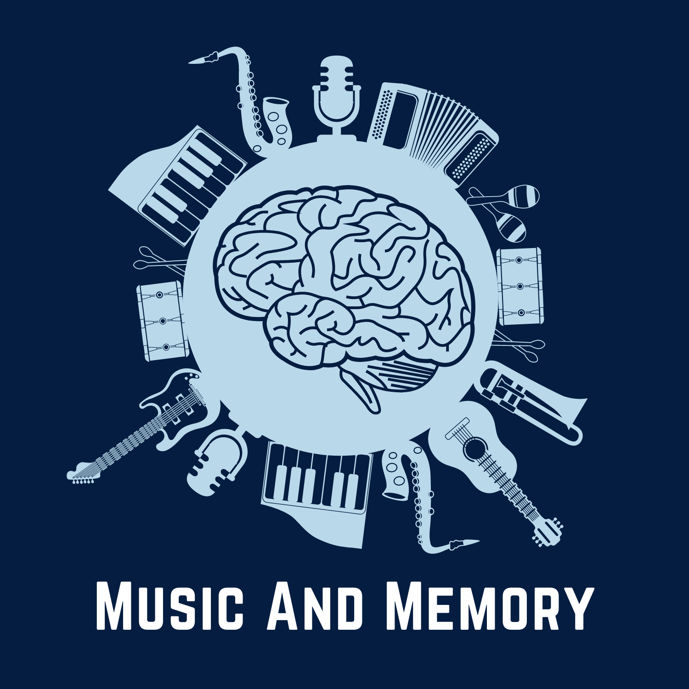

# AMFM Study Code & Data

This repository contains code, data, and materials for *Effects of familiar music exposure on deliberate retrieval of remote episodic and semantic memories in healthy aging adults*

A preprint for this registered report protocol can be found [here](https://psyarxiv.com/tejb4/)

## Data & code 

* Data and code for all main analyses in the manuscript can be found in the [manuscript_analysis](manuscript_analyses/README.md) folder
* A [Code Ocean](https://codeocean.com/) capsule with a containerized code environment allowing analyses to be fully reproduced on a cloud-based server is currently under review, and ultimately will be posted after incorporating all feedback. 

**Primary repo maintainer:** Paul A. Bloom (paul.bloom@columbia.edu)
